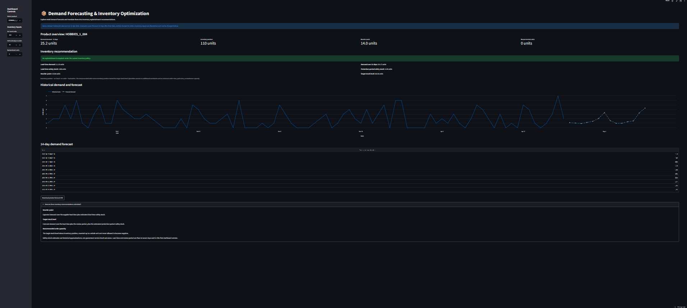
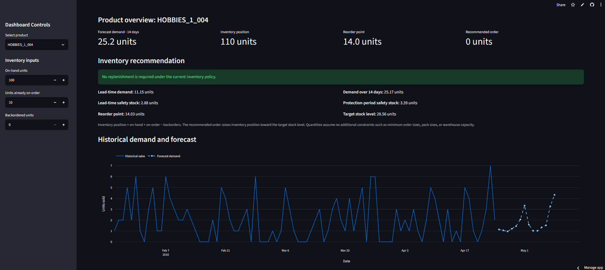

# Demand Forecasting & Inventory Optimization System

An end-to-end retail demand forecasting project that transforms historical sales data into demand predictions and inventory replenishment recommendations.

**Live Demo:** [Open the Streamlit Dashboard](https://demand-forecasting-inventory-mzk723zxhkfjqeer57gq9u.streamlit.app/)

## Project Overview

Retail businesses need to balance two competing risks: stockouts, which can result in lost sales, and overstocking, which ties up working capital.

This project explores how time-series machine learning can forecast product demand and support inventory decisions through safety stock estimation, reorder points, and recommended order quantities.

The prototype uses five Walmart product series from the M5 Forecasting dataset at the CA_1 store.

## Key Features

- Exploratory data analysis of product demand, weekly patterns, seasonal variation, and intermittent sales.
- Time-series feature engineering using lag values, rolling averages, rolling standard deviations, and calendar features.
- Comparison of naive, moving-average, seasonal-naive, Croston-SBA, and LightGBM forecasting approaches.
- Chronological validation and test evaluation rather than random train/test splitting.
- Recursive multi-day LightGBM forecasts.
- Empirical prediction intervals estimated from historical validation residuals.
- Inventory calculations for safety stock, reorder points, target stock levels, and suggested order quantities.
- Interactive Streamlit dashboard with product selection, configurable stock inputs, charts, forecast tables, and CSV download.

## Architecture

```text
M5 Historical Sales
        |
        v
Data Cleaning and Exploration
        |
        v
Time-Series Feature Engineering
        |
        v
Baseline Models and LightGBM
        |
        v
Chronological Validation and Evaluation
        |
        v
Demand Forecast and Error Analysis
        |
        v
Safety Stock and Reorder Calculations
        |
        v
Streamlit Dashboard
```

## Dataset

**Source:** [M5 Forecasting - Accuracy (Kaggle)](https://www.kaggle.com/competitions/m5-forecasting-accuracy/data)

The project uses the M5 Walmart retail sales dataset, including historical product sales, calendar information, events, and selling prices.

For the initial modelling prototype, the analysis is restricted to five HOBBIES products at the CA_1 store to keep development and experimentation manageable.

The historical data used by the current dashboard ends on **April 24, 2016**. Its forecasts are a demonstration based on historical data, not predictions of current retail demand.

The raw and processed datasets are excluded from the Git repository. The dashboard uses a separate, smaller set of exported demo CSV files.

## Tech Stack

- **Language:** Python
- **Data analysis:** Pandas, NumPy
- **Visualization:** Matplotlib, Seaborn, Plotly
- **Machine learning:** LightGBM, scikit-learn
- **Application:** Streamlit
- **Version control:** Git and GitHub
- **Deployment:** Streamlit Community Cloud
- **Environment:** Python virtual environment

## Feature Engineering

The forecasting features include:

- Calendar features: day of week, day of month, week of year, month, quarter, and weekend indicator.
- Lag features: 1, 7, 14, and 28 days.
- Rolling statistics: 7-, 14-, and 28-day averages, plus 7- and 28-day rolling standard deviations.
- Product identifiers to distinguish demand patterns across products.

Rolling features are shifted so that the current day's actual sales are not used to construct its own prediction features.

## Model Evaluation

Models were evaluated on chronological 28-day validation and test windows. Lower MAE, RMSE, and WAPE values indicate better performance.

### Validation Results

| Model | MAE | RMSE | WAPE |
|---|---:|---:|---:|
| Naive | 1.386 | 2.255 | 142.647% |
| Seasonal Naive | 1.143 | 1.728 | 117.647% |
| 7-Day Moving Average | 0.896 | 1.274 | 92.227% |
| LightGBM (recursive) | 0.871 | 1.287 | 89.698% |
| Croston-SBA | 0.842 | 1.202 | 86.687% |

Croston-SBA achieved the best overall validation metrics among these models.

### Held-Out Test Results

| Model | MAE | RMSE | WAPE |
|---|---:|---:|---:|
| LightGBM (recursive) | 0.876 | 1.214 | 91.519% |
| Croston-SBA | 0.885 | 1.202 | 92.499% |
| Hybrid (validation-selected) | 1.021 | 1.406 | 106.634% |
| 7-Day Moving Average | 1.049 | 1.447 | 109.595% |
| Seasonal Naive | 1.300 | 1.848 | 135.821% |
| Naive | 1.586 | 2.336 | 165.672% |

LightGBM achieved the lowest test MAE and WAPE, while Croston-SBA achieved the lowest test RMSE. The hybrid strategy did not generalize as well as either of these models.

These results apply only to the five selected product series and the specific evaluation windows. They should not be interpreted as evidence of performance across all Walmart products.

## Prediction Uncertainty

Prediction intervals were estimated using empirical quantiles of validation-period forecast residuals.

The observed coverage across the 140 test observations was approximately **78.6%**, below the intended nominal 90% interval coverage.

This indicates that the uncertainty estimates need further calibration and evaluation over multiple forecasting windows before they could support a reliable service-level guarantee.

## Inventory Optimization

The inventory layer estimates:

- Expected demand over supplier lead time.
- Safety stock from historical forecast errors.
- Reorder point.
- Target stock level over the lead time plus review period.
- Recommended replenishment quantity based on inventory position.

The current demonstration uses illustrative inventory levels and assumes a seven-day supplier lead time and a seven-day review period. These are configurable assumptions for the prototype, not observed Walmart inventory records.

The system uses the following simplified relationships:

**Reorder Point**

Expected lead-time demand + lead-time safety stock.

**Target Stock Level**

Expected demand over the protection period + protection-period safety stock.

**Recommended Order Quantity**

Maximum of zero and target stock level minus inventory position.

## Run Locally

### 1. Clone the repository

```bash
git clone https://github.com/suryanshutomar26-web/demand-forecasting-inventory.git
cd demand-forecasting-inventory
```

### 2. Create a virtual environment

```bash
python -m venv .venv
```

Activate it on Windows:

```powershell
.venv\Scripts\Activate.ps1
```

### 3. Install dependencies

```bash
python -m pip install -r requirements.txt
```

### 4. Run the dashboard

```bash
python -m streamlit run app/app.py
```

Streamlit will print the local URL for the application, usually `http://localhost:8501`.

The dashboard can run using the committed demo data under `app/data/`. Reproducing the complete modelling experiments requires downloading the M5 source data from Kaggle and placing the necessary source CSV files under `data/raw/`.

## Project Structure

```text
demand-forecasting-inventory/
├── app/
│   ├── app.py
│   ├── requirements.txt
│   └── data/
├── data/
│   ├── raw/
│   └── processed/
├── notebooks/
├── src/
├── models/
├── reports/
├── requirements.txt
├── README.md
└── .gitignore
```

## Limitations and Future Improvements

- Expand evaluation beyond five products and one store.
- Test multiple rolling-origin forecast windows and larger forecast horizons.
- Improve intermittent-demand handling and model selection.
- Calibrate prediction intervals using more historical forecast errors.
- Evaluate inventory performance through simulated stockouts, holding costs, and service levels.
- Incorporate real inventory, supplier lead-time, minimum-order, and procurement-cost information.
- Separate forecasting and inventory calculations into tested, reusable Python modules.
- Improve automated testing and reproducibility.

## Author

Developed as an end-to-end machine learning and data science portfolio project, with a focus on time-series forecasting, model evaluation, and practical inventory decision-making.


## Dashboard Preview



